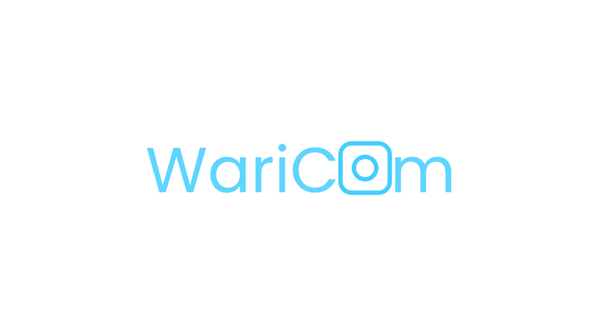
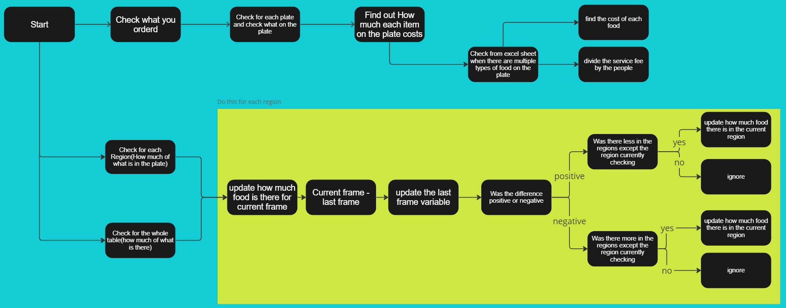
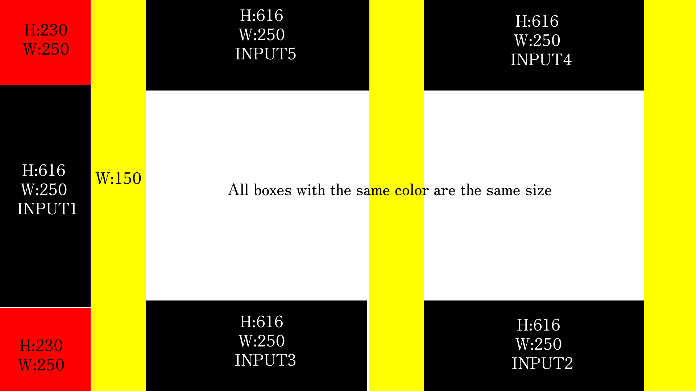

# About WariCam
## Overview:
Waricam is a app developed for splitting the bill between people by how much they ate so the bill gets split fairly.This project is a Hackathon project made in 2 weeks wich was updated a little bit afterwards.
## About the future of this project:   

・I want to add support for more food   
・Make it so you can setup the app from a excel file and it gives and report about what    was orderd and how much left over there were etc...   
・Update the UI as the UI is made with pygame and is slow so I want to make my own library with vulkan or something 
# Librarys used:

## ultralytics 
Object tracking and detection
pip:
```
pip install ultralytics
```
## pygame
Used for UI(UI will be updated to better one in the future)
pip:
```
pip install pygame
```
## Opencv
For visualisation of the tracking
 pip:
```
pip install opencv-python
```

## Python Version
Python 3.9.13 64-bitを使用

# About the algorithm

## This is the algorithm for finding how much a person ate


## Each region X and Y 

